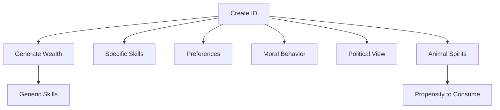
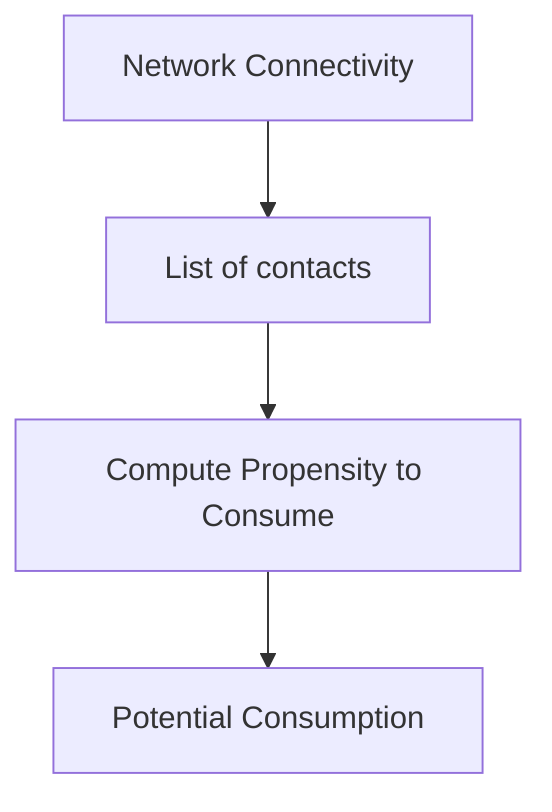

# Title of the chapter

## Initialization
At the beginning of the simulation, we need to decide the number of agents, $\tilde{N}$, the number of steps, or periods, in which the algorithm will iterate.

The initial creation of the agents, for each of them, follows this dynamic.

At this point, the intial consumption is $c_{i,t=0} = 0, \forall i$, and the connectivity is not initialized. Note that connectivity depends on the agent's wealth ranking among all the other agents. Hence, this variable can only be initialized once all the agents have their wealths generated.

## Dynamics

Before we can actually start the dynamics, some variables need to be computed. Now that all the agents have their initial endowment, we can generate their connectivity values.

